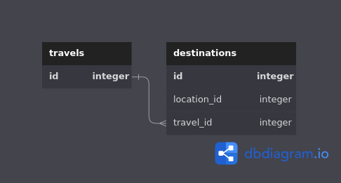

# Multiverse Travels Booker

Serviço de cadastro e consumo de dados CRUD de viagens interplanetárias.


## Instalação

Instalação de dependências 

```bash
  cd api
  shards install
```
    
## Bancos de dados
### Migração e setup
Para o **funcionamento nos testes automatizados** é preciso rodar o script de migração
```bash
/bin/bash migrations.sh 
```
### Schema do banco de dados


## Rodadando a aplicação
Para rodar o projeto, execute o seguinte comando

```bash
  /bin/bash migrations.sh 
  docker-compose up -d --build
```
Abra o navegador e acesse o endereço [http://localhost:3000/travel_plans](http://localhost:3000/travel_plans)

## Variáveis de Ambiente

Para rodar esse projeto localmente, você vai precisar adicionar as seguintes variáveis de ambiente no seu .env

`POSTGRES_HOST`

`POSTGRES_PORT`

`POSTGRES_USER`

`POSTGRES_PASSWORD`

`POSTGRES_DB`


## Endpoints
| HTTP Method | Path                | Description                          |
| ----------- | ------------------- | ------------------------------------ |
| GET         | /travel_plans      | Retorna todas viagens existentes       |
| GET         | /travel_plans/:id  | Retorna viagem escolhida por id     |
| POST        | /travel_plans      | Cria uma nova viagem             |
| PUT         | /travel_plans/:id  | Atualiza uma viagem existente escolhida por id  |
| DELETE      | /travel_plans/:id  | Deleta uma viagem existente escolhida por id  |
| PATCH      | /travel_plans/:id/append  | Adiciona paradas adicionais a uma viagem já existende  |

## Documentação da API

### Retorna todas viagens

```http
  GET /travel_plans
```

| Parâmetro   | Tipo       | Descrição                           |
| :---------- | :--------- | :---------------------------------- |
| `optimize` | `string` | **Opcional**. Otimiza as viagens por popularidade da dimensão |
| `expand` | `string` | **Opcional**. Expande o resultado,mostrando mais informações além da Id da viagem |

- A requisição retornará por padrão:
```json
[
  {
    "id": 1,
    "travel_stops": [1, 2]
  },
  {
    "id": 2,
    "travel_stops": [3, 7]
  }
]
```
- Usando paramentros opcionais: Viagems otimizadas

```http
GET /travel_plans?optimize=true&expand=false
```
```json
[
  {
    "id": 1,
    "travel_stops": [
      2,
      1
    ]
  },
  {
    "id": 2,
    "travel_stops": [
      4,
      3
    ]
  }
]
```
- Usando paramentros opcionais: Viagems otimizadas e expandidas

```http
GET /travel_plans?optimize=true&expand=true
```
```json
[
  {
    "id": 1,
    "travel_stops": [
      {
        "id": 2,
        "name": "Abadango",
        "type": "Cluster",
        "dimension": "unknown"
      },
      {
        "id": 1,
        "name": "Earth (C-137)",
        "type": "Planet",
        "dimension": "Dimension C-137"
      }
    ]
  },
  {
    "id": 2,
    "travel_stops": [
      {
        "id": 4,
        "name": "Worldender's lair",
        "type": "Planet",
        "dimension": "unknown"
      },
      {
        "id": 3,
        "name": "Citadel of Ricks",
        "type": "Space station",
        "dimension": "unknown"
      }
    ]
  }
]
```
- Usando paramentros opcionais: Viagems expandidas
```http
GET /travel_plans?optimize=false&expand=true
```
```json
[
  {
    "id": 1,
    "travel_stops": [
      {
        "id": 1,
        "name": "Earth (C-137)",
        "type": "Planet",
        "dimension": "Dimension C-137"
      },
      {
        "id": 2,
        "name": "Abadango",
        "type": "Cluster",
        "dimension": "unknown"
      }
    ]
  },
  {
    "id": 2,
    "travel_stops": [
      {
        "id": 3,
        "name": "Citadel of Ricks",
        "type": "Space station",
        "dimension": "unknown"
      },
      {
        "id": 7,
        "name": "Immortality Field Resort",
        "type": "Resort",
        "dimension": "unknown"
      }
    ]
  }
]
```
### Retorna um item

```http
  GET /travel_plans/${id}
```

| Parâmetro   | Tipo       | Descrição                                   |
| :---------- | :--------- | :------------------------------------------ |
| `id`      | `string` | **Obrigatório**. O ID da viagem que você quer |
| `optimize` | `string` | **Opcional**. Otimiza as viagens por popularidade da dimensão |
| `expand` | `string` | **Opcional**. Expande o resultado,mostrando mais informações além da ID da viagem |

- A requisição retornará:
```json
  {
    "id": 1,
    "travel_stops": [1, 2]
  }
```
- Usando paramentros opcionais: Viagems otimizadas

```http
GET /travel_plans/1?optimize=true&expand=false
```
```json
  {
    "id": 1,
    "travel_stops": [
      2,
      1
    ]
  }
```
- Usando paramentros opcionais: Viagems otimizadas e expandidas

```http
GET /travel_plans/1?optimize=true&expand=true
```
```json
  {
    "id": 1,
    "travel_stops": [
      {
        "id": 2,
        "name": "Abadango",
        "type": "Cluster",
        "dimension": "unknown"
      },
      {
        "id": 1,
        "name": "Earth (C-137)",
        "type": "Planet",
        "dimension": "Dimension C-137"
      }
    ]
  }
```
- Usando paramentros opcionais: Viagems expandidas
```http
GET /travel_plans?optimize=false&expand=true
```
```json
  {
    "id": 1,
    "travel_stops": [
      {
        "id": 1,
        "name": "Earth (C-137)",
        "type": "Planet",
        "dimension": "Dimension C-137"
      },
      {
        "id": 2,
        "name": "Abadango",
        "type": "Cluster",
        "dimension": "unknown"
      }
    ]
  }
```

### Cadastra uma nova viagem
```http
  POST /travel_plans
```
- O corpo da requisição poderá seguir o formato abaixo:

```json
{
  "travel_stops": [3,4]
}
```
- Retornará a viagem cadastrada:
```json
{  
  "id": 3,
  "travel_stops": [3,4]
}
```
#### Atualiza uma uma viagem
```http
  PUT /travel_plans/${id}
```
| Parâmetro   | Tipo       | Descrição                                   |
| :---------- | :--------- | :------------------------------------------ |
| `id`      | `string` | **Obrigatório**. O ID do item que você quer |
- O corpo da requisição poderá seguir o formato abaixo:

```json
{
  "travel_stops": [5,7]
}
```
- Retornará a viagem atualizada:
```json
{  
  "id": 3,
  "travel_stops": [5,7]
}
```
### Deleta uma viagem

```http
  DELETE /travel_plans/${id}
```

| Parâmetro   | Tipo       | Descrição                                   |
| :---------- | :--------- | :------------------------------------------ |
| `id`      | `string` | **Obrigatório**. O ID do item que você quer |

- **Sem rotorno**

### Adiciona mais destinos a uma viagem existente
```http
  PATCH /travel_plans/${id}/append
```
| Parâmetro   | Tipo       | Descrição                                   |
| :---------- | :--------- | :------------------------------------------ |
| `id`      | `string` | **Obrigatório**. O ID do item que você quer |

```json
{
  "travel_stops": [5,7]
}
```
- Retornará a viagem atualizada com as paradas adicionais:
```json
{  
  "id": 3,
  "travel_stops": [2,4,9,5,7]
}
```
## Funcionalidades

- [Kemal](https://github.com/kemalcr/kemal): Fast, Effective, Simple Web Framework
- [Jennifer](https://github.com/imdrasil/jennifer.cr): Crystal ORM using ActiveRecord pattern with flexible query DSL
- Uso de PostgreSQL no banco de dados


## Rodando os testes

Devido a natureza do processo seletivo e a escassa documentão e material disponível, não foi possível a implementação dos testes unitários e de integração.**Peço compreensão da banca avaliadora**


## Autores

- [Lucas Vieira](https://www.github.com/beterrabaa)

